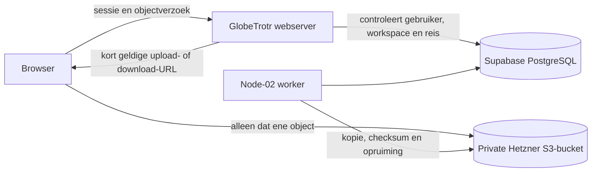

# Opslagarchitectuur

**Besluit: 25 september 2026**

## Advies

Een Hetzner Object Storage-bucket is een goede volgende stap voor GlobeTrotr. Koop hem zodra de vaste maandprijs acceptabel is en gebruik hem eerst voor versleutelde herstelkopieën. Verplaats de productie-opslag voor gebruikersbestanden pas nadat de servergateway en migratiecontrole zijn gebouwd.

Release 1.0 blijft Supabase Storage gebruiken voor avatars, Agency-logo's, bonnetjes, reisdocumenten, bedrijfsmailbijlagen en dagboekfoto's. Deze bestanden gebruiken nu Supabase Auth, RLS en ondertekende URL's als één beveiligingsmodel. Een rechtstreekse browserverbinding met een algemene Hetzner S3-sleutel zou die bescherming omzeilen.

Hetzner toont momenteel een basispakket van € 4,99 per maand exclusief btw met 1 TB opslag en 1 TB uitgaand verkeer. Inkomend verkeer, S3-operaties en intern verkeer binnen `eu-central` zijn kosteloos. Controleer de actuele prijs vóór bestelling:

- <https://www.hetzner.com/storage/object-storage/overview/>
- <https://docs.hetzner.com/storage/object-storage/overview/>

Kies voor de productieomgeving een EU-locatie, bij voorkeur `nbg1` (Nürnberg). De Supabase-productieregio blijft Central EU (Frankfurt); dit zijn afzonderlijke datacenters en dus geen gedeelde lokale opslag.

## Gewenste architectuur



De database bewaart later minimaal:

- `provider`: `supabase` of `hetzner_s3`;
- `bucket` en een willekeurige `object_key`;
- eigenaar, workspace en eventueel reis;
- MIME-type, bestandsgrootte en SHA-256-checksum;
- aanmaak-, verwijder- en bewaartermijnvelden.

Een publieke URL geldt nooit als autorisatie. De browser ontvangt alleen een kort geldige URL nadat GlobeTrotr de actuele rechten heeft gecontroleerd. S3-toegangssleutels staan uitsluitend op de server en worker.

## Buckets en sleutels

Gebruik afzonderlijke private buckets en zo mogelijk afzonderlijke sleutels:

| Bucket | Doel | Browsertoegang |
| --- | --- | --- |
| `globetrotr-user-files-prod` | toekomstige grote gebruikersbestanden | uitsluitend via kort geldige URL |
| `globetrotr-backups-prod` | versleutelde database- en objectback-ups | nooit |

Maak voor test en productie geen gedeelde bucket of sleutel. Zet geen sleutel in `VITE_*`, frontendcode, Git, documentatie of een publieke CI-log. De standaard Hetzner-projectsleutel kan meerdere buckets bereiken; beperk daarom het project en roteer een sleutel direct bij mogelijke blootstelling.

## Bouwvolgorde

### Fase 0 — nu mogelijk: herstelkopieën

1. Maak `globetrotr-backups-prod` als private bucket.
2. Bewaar de sleutel alleen in de secrets van de back-upworker.
3. Versleutel vóór upload en schrijf nooit tijdelijke secrets naar de repository.
4. Test maandelijks een herstel naar een lege testomgeving.
5. Houd minstens één herstelkopie buiten de primaire VPS-accountgrens.

Een objectstore is geen vervanging voor een geteste databaseback-up.

### Fase 1 — servergateway bouwen

1. Provider-onafhankelijke objectmetadata en uploadregels zijn voorbereid in migratie 1810 en `src/lib/object-storage-policy.ts`.
2. Bouw serverfuncties voor upload starten, download openen en verwijderen.
3. Controleer vóór iedere URL gebruikers-, workspace-, reis- en bewaartermijnrechten.
4. Begrens type, grootte, aantal, geldigheidsduur en uploadsnelheid.
5. Scan nieuwe bestanden vóór definitieve beschikbaarheid en registreer auditdetails zonder bestandsinhoud.

### Fase 2 — nieuwe dagboekfoto's

Nieuwe dagboekfoto's zijn de eerste geschikte productstroom: ze kunnen snel groeien en hebben al duidelijke reisrechten. Bestaande Supabase-objecten blijven leesbaar. Nieuwe records krijgen de provider expliciet mee; er komt geen stille globale omschakeling.

### Fase 3 — gecontroleerde migratie

1. Kopieer op de achtergrond, zonder het bronobject te verwijderen.
2. Vergelijk bestandsgrootte en checksum.
3. Lees eerst de nieuwe locatie en val tijdelijk terug op Supabase.
4. Meet fouten en voer een hersteltest uit.
5. Verwijder de oude kopie pas na de afgesproken bewaartermijn.

Documenten, bonnetjes en mailbijlagen verhuizen pas nadat dagboekfoto's stabiel werken. Avatars en kleine publieke merkassets hoeven alleen te verhuizen als kosten of beheer daar later aanleiding toe geven.

## Wat release 1.0 niet nodig heeft

- geen Hetzner S3-variabelen in `.env.production`;
- geen wijziging aan DNS, Caddy, Supabase-buckets of bestaande objectpaden;
- geen publieke bucket;
- geen nieuwe frontend-S3-library;
- geen migratie van bestaande bestanden.

De aanschaf van een bucket activeert dus niets in GlobeTrotr. De huidige uitrol blijft werken terwijl de gateway afzonderlijk wordt gebouwd en getest.

## Later in één keer aansluiten

De serverconfiguratie en validatie zijn voorbereid in `src/lib/object-storage-config.server.ts`. Zolang onderstaande waarde ontbreekt of `supabase` is, verandert er niets:

```dotenv
OBJECT_STORAGE_PROVIDER=supabase
```

Na aanschaf maak je beide private buckets en vul je op Node-01 en Node-02 in:

```dotenv
OBJECT_STORAGE_PROVIDER=hetzner_s3
OBJECT_STORAGE_ENDPOINT=https://nbg1.your-objectstorage.com
OBJECT_STORAGE_REGION=nbg1
OBJECT_STORAGE_USER_FILES_BUCKET=globetrotr-user-files-prod
OBJECT_STORAGE_BACKUPS_BUCKET=globetrotr-backups-prod
OBJECT_STORAGE_ACCESS_KEY_ID=VUL_LATER_IN
OBJECT_STORAGE_SECRET_ACCESS_KEY=VUL_LATER_IN
```

Zet `OBJECT_STORAGE_PROVIDER` pas op `hetzner_s3` wanneer de gateway, metadata-migratie en praktijktest klaar zijn. De configuratiecontrole weigert HTTP, ontbrekende waarden, ongeldige bucketnamen en één gedeelde bucket voor gebruikersbestanden en back-ups. Sleutels komen nooit in `VITE_*` terecht. Migratie 1810 maakt uitsluitend server-only metadata aan en verplaatst of uploadt nog geen bestand.

## Worker-VPS

`platform_provider_controls` blijft de centrale noodstop per externe dienst. `external_api_usage` bewaakt dagquota per workspace. `worker_jobs` gebruikt idempotentiesleutels, `FOR UPDATE SKIP LOCKED`, maximaal tien pogingen en begrensde back-off. Alleen de service-role kan deze tabellen en functies gebruiken.
